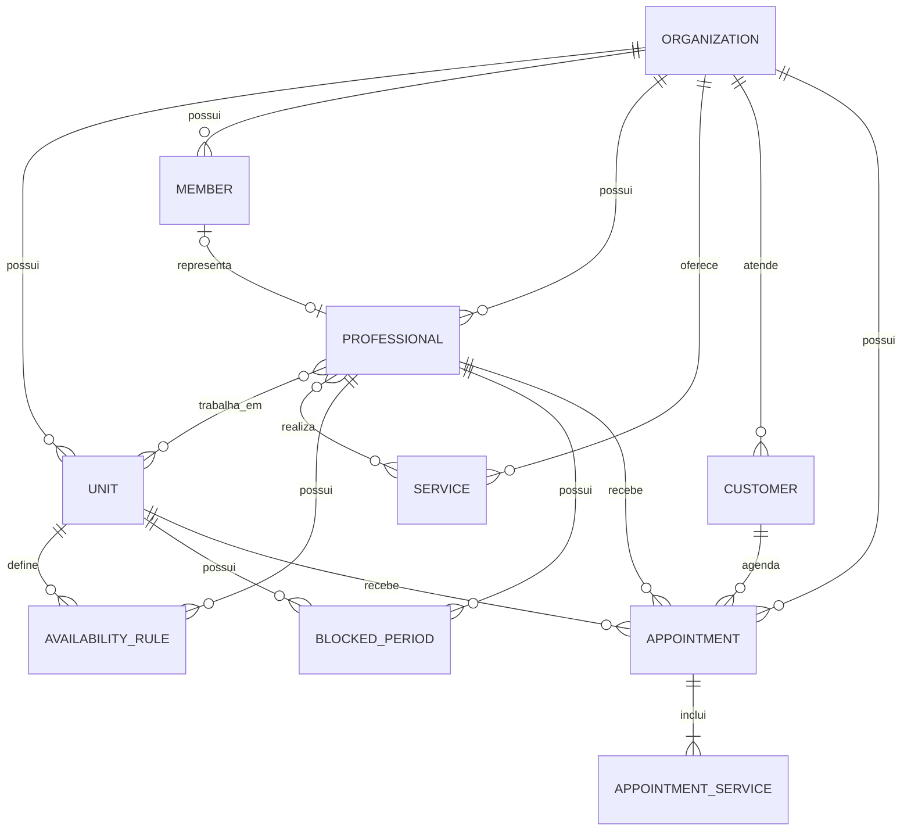

# Modelo de domínio

## Objetivo

A Appointment Platform atende organizações que trabalham com agendamentos de serviços.

Cada organização possui seus próprios dados, unidades, profissionais, clientes e configurações. Nenhuma organização pode acessar dados de outra.

## Entidades principais

### Organization

Representa uma empresa que utiliza a plataforma.

Exemplos: barbearia, salão, clínica ou estúdio.

Dados principais:

- Nome.
- Identificador público.
- Fuso horário.
- Configurações gerais.
- Situação ativa ou inativa.

### Unit

Representa uma unidade física da organização.

Uma organização pode possuir uma ou várias unidades.

Dados principais:

- Organização.
- Nome.
- Endereço.
- Fuso horário, caso seja diferente.
- Situação ativa ou inativa.

### Member

Representa uma pessoa com acesso ao painel da organização.

Papéis iniciais:

- `owner`: proprietário.
- `admin`: administrador.
- `receptionist`: recepcionista.
- `professional`: profissional.

### Professional

Representa uma pessoa que pode receber agendamentos.

O profissional pode estar vinculado a um membro com login, mas isso não é obrigatório.

Dados principais:

- Organização.
- Nome.
- Unidades em que trabalha.
- Serviços que realiza.
- Modo de confirmação automática ou manual.
- Situação ativa ou inativa.

### Service

Representa um serviço oferecido pela organização.

Dados principais:

- Nome.
- Descrição.
- Preço padrão.
- Duração padrão.
- Intervalo adicional depois do atendimento.
- Situação ativa ou inativa.

Um serviço pode ser realizado por vários profissionais. Um profissional pode realizar vários serviços.

### Customer

Representa um cliente de uma organização.

Dados principais:

- Nome.
- Telefone.
- E-mail opcional.
- Observações.
- Organização proprietária dos dados.

O cliente não precisa criar uma conta para realizar o primeiro agendamento.

### AvailabilityRule

Representa o horário recorrente de trabalho de um profissional.

Dados principais:

- Profissional.
- Unidade.
- Dia da semana.
- Horário inicial.
- Horário final.

Um profissional pode possuir mais de um intervalo no mesmo dia, permitindo representar horário de almoço.

### BlockedPeriod

Representa um período em que o profissional não pode receber agendamentos.

Exemplos:

- Folga.
- Férias.
- Compromisso.
- Bloqueio manual.
- Manutenção da unidade.

Dados principais:

- Profissional ou unidade.
- Início.
- Fim.
- Motivo.

### Appointment

Representa uma reserva de horário.

Dados principais:

- Organização.
- Unidade.
- Profissional.
- Cliente.
- Início e fim programados.
- Início e fim reais.
- Status.
- Data de expiração, quando aguarda confirmação manual.
- Valor previsto.
- Valor final.
- Data de conclusão.

Mesmo quando o cliente escolhe “qualquer profissional”, o agendamento final pertence a um profissional específico selecionado pelo sistema.

### AppointmentService

Representa um serviço incluído no agendamento.

Um agendamento pode possuir vários serviços.

Dados preservados:

- Serviço original.
- Nome do serviço no momento da reserva.
- Preço no momento da reserva.
- Duração no momento da reserva.

Esses valores são preservados para que alterações futuras no serviço não modifiquem o histórico.

## Relacionamentos



## Status do agendamento

- `pending`: aguardando confirmação manual.
- `confirmed`: confirmado.
- `in_progress`: atendimento iniciado.
- `completed`: atendimento concluído.
- `cancelled`: cancelado.
- `rejected`: rejeitado pelo profissional.
- `no_show`: cliente não compareceu.
- `expired`: confirmação manual não ocorreu dentro do prazo.

Fluxo principal:

```text
pending → confirmed → in_progress → completed
    ├──→ rejected
    ├──→ expired
    └──→ cancelled

confirmed → cancelled
confirmed → no_show
```

No modo automático, o agendamento começa diretamente como `confirmed`.

## Regras essenciais

1. Todos os dados pertencem a uma organização.
2. Um profissional não pode ter agendamentos sobrepostos.
3. Uma solicitação `pending` bloqueia temporariamente o horário.
4. Solicitações manuais possuem prazo de expiração.
5. A duração total é a soma dos serviços e intervalos adicionais.
6. O agendamento precisa terminar dentro da disponibilidade do profissional.
7. Bloqueios e folgas removem horários da disponibilidade.
8. Somente agendamentos `completed` entram no faturamento.
9. O valor final pode ser ajustado ao concluir o atendimento.
10. Preço e duração dos serviços são preservados no histórico.
11. Datas são armazenadas em UTC e exibidas no fuso da organização ou unidade.
12. Cancelados, rejeitados, expirados e faltas não entram no faturamento.
13. Todo agendamento pertence a uma organização, unidade, profissional e cliente, e possui pelo menos um serviço.
